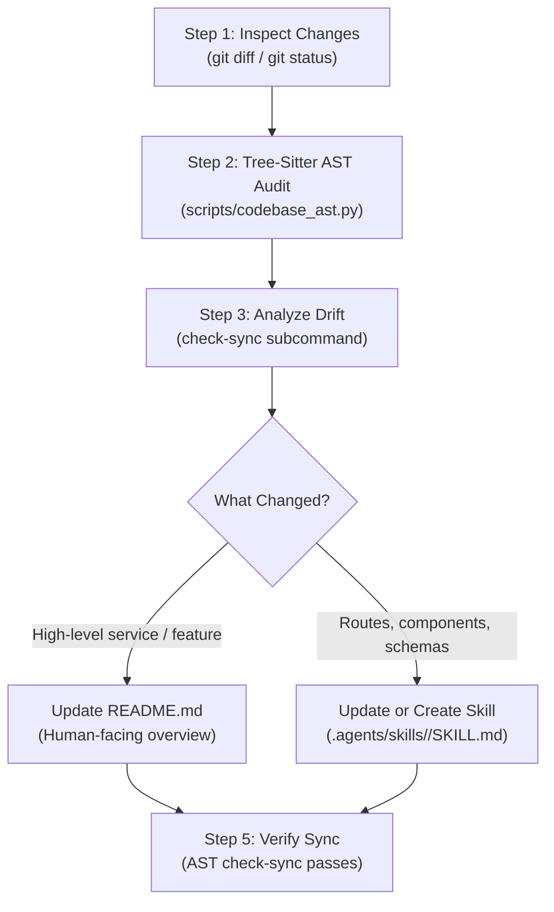

# Skills & README Maintenance Runbook

This skill defines the operational procedure for an agent acting as the repository's **Documentation & Skills Maintainer**. It formalizes the workflow of detecting codebase changes, updating agent runbooks, and maintaining human-facing project overviews.

---

## Core Principles: Human vs. Agent Documentation

| Audience | Target Document | Purpose & Content | Anti-Patterns |
|---|---|---|---|
| **Humans** (Users & Devs) | [`README.md`](file:///e:/Dev/healthcare-data-rest/README.md) | **High-level orientation**: Problem statement, system architecture, major components, prerequisites, and getting started guides. | Do NOT dump exhaustive low-level AST symbol listings, handler internals, or raw JSON payloads. |
| **Agents** (Pair Programmers) | [`.agents/skills/`](file:///e:/Dev/healthcare-data-rest/.agents/skills/) | **Actionable runbooks**: Concrete code patterns, route contracts, parameter formats, threading rules, CLI flags, and architectural patterns. | Do NOT leave skills as vague descriptions without runnable examples or concrete file references. |

---

## The 5-Step Maintenance Workflow

Whenever other agents make commits, add features, or modify existing modules in the workspace, execute this 5-step loop:



### Step 1: Inspect Workspace Changes
Check what files were touched by preceding agents:
```bash
git status --short
git diff --name-only HEAD~1
```

### Step 2: Run Tree-Sitter AST Extraction via `uv`
Audit all routes, structs, repository methods, frontend components, and database schemas:
```bash
uv run --with tree-sitter --with tree-sitter-rust --with tree-sitter-typescript --with tree-sitter-sql python scripts/codebase_ast.py scan
```

### Step 3: Check for Documentation Drift
Run the automated synchronization check:
```bash
uv run --with tree-sitter --with tree-sitter-rust --with tree-sitter-typescript --with tree-sitter-sql python scripts/codebase_ast.py check-sync
```

### Step 4: Route Updates to the Right Destination

#### If High-Level Architecture Changed:
- Modify `README.md` to reflect new services, updated prerequisites, or new quickstart instructions.
- Ensure the mermaid architecture diagram matches the current topology.

#### If Repeated Procedures or Code Patterns Changed:
Update or create the relevant skill in `.agents/skills/`:
- **Backend changes** (new routes, handlers, error types): Update [`healthcare-backend-api`](file:///e:/Dev/healthcare-data-rest/.agents/skills/healthcare-backend-api/SKILL.md).
- **Frontend changes** (new views, layout components, hook conventions): Update [`healthcare-frontend`](file:///e:/Dev/healthcare-data-rest/.agents/skills/healthcare-frontend/SKILL.md).
- **DuckLake / Database changes** (new Parquet tables, views, pool settings): Update [`healthcare-ducklake`](file:///e:/Dev/healthcare-data-rest/.agents/skills/healthcare-ducklake/SKILL.md).
- **New Cross-Cutting Pattern** (e.g., adding an MCP server, auth middleware, or testing harness): Create a new skill folder with `SKILL.md` containing standard YAML frontmatter:
  ```markdown
  ---
  name: <skill-name>
  description: >-
    Brief 1-2 sentence description of when and how to use this skill.
  ---
  ```

### Step 5: Validate and Close the Loop
Re-run `check-sync` to ensure exit code 0:
```bash
uv run --with tree-sitter --with tree-sitter-rust --with tree-sitter-typescript --with tree-sitter-sql python scripts/codebase_ast.py check-sync
```
Confirm that all skills adhere to formatting guidelines:
- YAML frontmatter with `name` and `description`
- Standard markdown file links using `file:///` URIs
- Concrete code blocks showing how to perform the procedure
