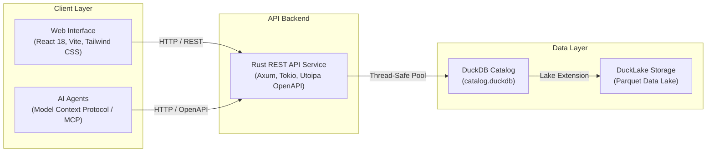

# Healthcare Price Transparency Platform

A nationwide hospital price transparency and procedure comparison platform powered by DuckDB, DuckLake, a high-performance Rust backend, and a modern responsive web interface.

---

## Overview & Goal

Navigating healthcare pricing in the United States is notoriously opaque. Hospitals are legally required to publish machine-readable files (MRFs) containing standard charges, negotiated rates with commercial insurers, and discounted cash prices.

This project aggregates, indexes, and surfaces this data to empower patients, researchers, and developers:
- **Hospital Directory**: Search across thousands of hospitals in all 50 states by facility name, address, city, state, or CMS certification ID.
- **Price Comparison Engine**: Compare negotiated rates for specific procedures (by CPT, HCPCS, or MS-DRG code) across insurance plans (Aetna, Blue Cross, Cigna, UnitedHealthcare, etc.) and cash rates to find the most cost-effective facility in an area.
- **Data-Driven Intelligence**: Built on top of a multi-gigabyte DuckLake snapshot containing verified CMS hospital records and millions of rate entries.
- **AI-First / MCP Ready**: Designed from the ground up to integrate with AI agents through Model Context Protocol (MCP) servers and standard REST APIs.

---

## System Architecture



### High-Level Components

1. **Frontend (`frontend/`)**:
   - Built with React 18, TypeScript, Vite, and Tailwind CSS.
   - Mobile-first, WCAG 2.1 AA accessible interface.
   - Dedicated views for Hospital Discovery, Procedure Search, Cross-Plan Price Comparisons, and Platform Information.

2. **Backend Engine (`backend/` & `common/`)**:
   - Asynchronous REST API service built in Rust using Tokio and Axum.
   - OpenAPI 3.0 documentation with interactive Swagger UI.
   - Thread-safe DuckDB connection pooling with non-blocking query execution.

3. **Data Lake (`lake/` & `loader/`)**:
   - DuckLake format managing versioned Parquet files and metadata.
   - Curated views for deduplicated active hospitals and service charges.
   - Data loading pipeline for ingesting CMS and hospital machine-readable files.

---

## Getting Started

### Prerequisites
- **Rust toolchain** (1.80+ recommended)
- **Node.js** (v20+ or v24) and **npm**
- **DuckDB** (v1.5+ for DuckLake compatibility)
- **uv** (optional, for running developer AST tooling)

### 1. Launching the Backend Service

From the repository root:
```bash
cargo run -p backend
```
By default, the backend binds to `http://localhost:3000`:
- **API Base**: `http://localhost:3000/api/v1`
- **Interactive Swagger UI**: `http://localhost:3000/swagger-ui/`
- **OpenAPI 3.0 Specification**: `http://localhost:3000/api/v1/openapi.json`

### 2. Launching the Frontend Web Application

From the `frontend/` directory:
```bash
cd frontend
npm install
npm run dev
```
Open your browser to `http://localhost:5173`. The Vite development server automatically proxies API requests to the Rust backend on port 3000.

---

---

## Data Sources & Replication Guide

CarePrice is committed to open data and reproducible research. All hospital pricing and facility records are derived from public datasets mandated by federal transparency regulations.

### 1. Declared Data Sources & Download Origin

> [!IMPORTANT]
> **Dataset Storage & Git Exclusions**:
> The 74GB+ compressed DuckLake snapshot archive (`mrf_lake_*.zip`), the unzipped data lake directory (`lake/`), and all DuckDB database files (`*.duckdb`, `*.ducklake`, `*.parquet`) are intentionally excluded from git via `.gitignore`. **Never commit large data archives, DuckDB files, or Parquet catalogs to the repository.**

1. **Hospital Price Transparency Machine-Readable Files (MRFs) / DuckLake**:
   - **Origin & Provider**: Published by **Trilliant Health** as an open-access healthcare dataset at **[oria-data.trillianthealth.com](https://oria-data.trillianthealth.com/)** (and via **[oria.trillianthealth.com](https://oria.trillianthealth.com/)**).
   - **Legal Mandate**: Mandated under **CMS 45 CFR § 180**, hospitals operating in the United States must publicly publish annual machine-readable files detailing gross chargemaster prices, discounted cash rates, and insurer-specific negotiated charges.
   - **Packaging**: Aggregated, normalized, and packaged into a self-contained **DuckLake 1.0** columnar Parquet catalog (`metadata.ducklake`, `catalog.duckdb`, and `data/main/`), providing indexed query performance across 7,916 hospitals and millions of negotiated pricing quotes.
   - **Where to Download**: Download the latest DuckLake snapshot archive (e.g. `mrf_lake_20260721.zip`) directly from the **[Trilliant Health Open Data Portal](https://oria-data.trillianthealth.com/)**.
2. **DOGE / CMS Medicare Reimbursement Benchmark Dataset**:
   - **Origin**: Public Medicare fee-for-service provider utilization and payment datasets cross-referenced with Department of Government Efficiency (DOGE) public data feeds.
   - **Purpose**: Establishes government reimbursement baselines and markup multiples for private commercial insurance negotiations.
3. **CMS iQIES Provider of Services (POS) Directory**:
   - **Origin**: Centers for Medicare & Medicaid Services (CMS) Quality Improvement and Evaluation System (`iQIES POS Data Dictionary.xlsx`).
   - **Purpose**: Canonical mapping for CMS Certification Numbers (CCN), National Provider Identifiers (NPI), facility street addresses, geographic coordinates, and hospital operational categories.

---

### 2. Step-by-Step Dataset Replication

Any researcher or developer can independently replicate the data lake and local runtime:

#### Step 1: System Prerequisites
- **DuckDB**: Version >= 1.5 (required for DuckLake format 1.0)
- **Rust**: Version >= 1.80 (`cargo`, `rustc`)
- **Node.js**: Version >= 20 or 24 with `npm`

#### Step 2: Download & Extract the DuckLake Archive
1. Download the DuckLake snapshot archive (e.g. `mrf_lake_20260721.zip`, ~74GB compressed) from the **[Trilliant Health Open Data Portal](https://oria-data.trillianthealth.com/)**.
2. Place the downloaded archive in the project root or a temporary download location.
3. Extract the archive into the `lake/` directory:
```bash
# Extract into the lake/ directory (creates metadata.ducklake, catalog.duckdb, and data/)
unzip mrf_lake_20260721.zip -d lake/
```
Verify that the `lake/` directory contains:
- `open-lake.sql` and `open-lake.sh`
- `catalog.duckdb` (curated convenience views)
- `metadata.ducklake` (DuckLake snapshot registry)
- `data/` (columnar Parquet storage)

#### Step 3: Mount & Query in DuckDB CLI
You can inspect the lake tables directly using DuckDB:
```bash
cd lake
duckdb -readonly -init open-lake.sql catalog.duckdb
```
Or attach manually within any DuckDB session:
```sql
INSTALL ducklake;
LOAD ducklake;
ATTACH 'ducklake:metadata.ducklake' AS lake (DATA_PATH 'data', OVERRIDE_DATA_PATH true, READ_ONLY);

-- Query deduplicated active hospitals
SELECT COUNT(*) FROM current_hospitals;

-- Query sample negotiated standard charges
SELECT hospital_name, description, payer_name, standard_charge_dollar 
FROM current_charges 
LIMIT 20;
```

#### Step 4: Run the Backend & Frontend Stack
```bash
# 1. Start backend REST service (listening on port 3000)
cargo run -p backend -- --lake-dir ./lake

# 2. In a separate terminal, launch the web application
cd frontend
npm install
npm run dev
```
Navigate to `http://localhost:5173` to access the interactive Price Comparison engine, Hospital Directory, and the in-app **Data Sources & Replication** page.

---

## Developer Tooling & Verification

The project includes an automated Tree-Sitter AST analyzer that parses Rust, TypeScript/TSX, and SQL codebases without requiring manual environment setup:

```bash
# Scan codebase AST and inspect routes, models, and components
uv run --with tree-sitter --with tree-sitter-rust --with tree-sitter-typescript --with tree-sitter-sql python scripts/codebase_ast.py scan

# Verify documentation and skills synchronization
uv run --with tree-sitter --with tree-sitter-rust --with tree-sitter-typescript --with tree-sitter-sql python scripts/codebase_ast.py check-sync
```

For agent runbooks, code conventions, and repeated developer procedures, see `.agents/skills/`.

---

## License

This project is licensed under the MIT License. See [LICENSE](file:///e:/Dev/healthcare-data-rest/LICENSE) for details.